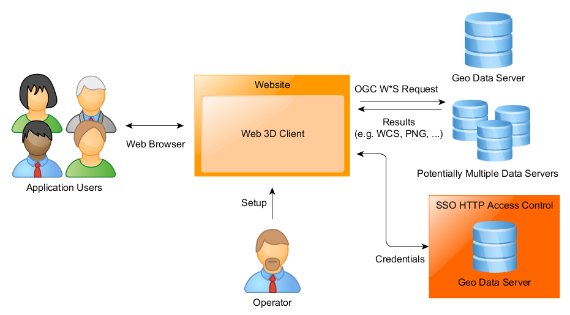
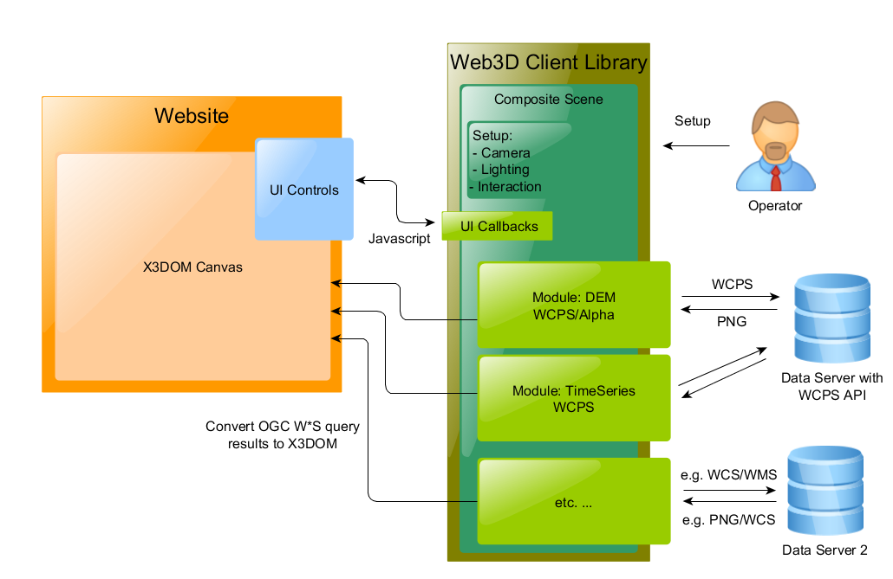
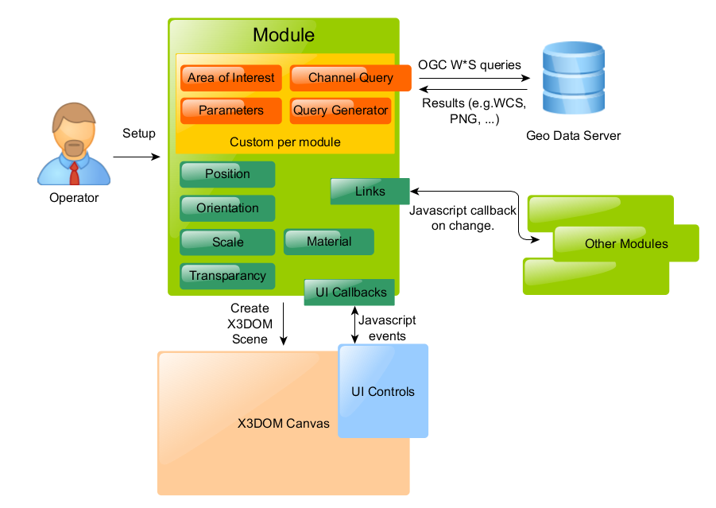

.. toctree::
   :maxdepth: 2
   
3D Web Client - Tutorial
========================

The EarthServer 3D Web Client is both component for your website as well as a platform for you to develop custom solutions on top of. To give you an overview, we will first introduce you to the architecture and concept and then walk you through an example. On top of that, there are other examples to be found as part of the client's source package and there is an API reference available as well.

Links
-----

The Web Client described in this tutorial is just part of a stack of software and protocols.

	* `X3DOM <http://www.x3dom.org/>`_ - an open-source middleware developed by Fraunhofer IGD, that allows you to embed `X3D <http://www.web3d.org/x3d/>`_ (or a close approximation) directly into the DOM of your website.
	* We also use `JQuery <http://jquery.com/>`_ and `JQueryUI <http://jqueryui.com/>`_.
	* `WCPS <http://www.opengeospatial.org/standards/wcps>`_, `WCS <http://www.opengeospatial.org/standards/wcs>`_, `WMS <http://www.opengeospatial.org/standards/wms>`_ and other protocols maintained and developed by the `OGC <http://www.opengeospatial.org/>`_ are used to query data from servers supporting these protocols (e.g. `rasdaman <http://www.rasdaman.org/>`_ which is offered as a Community Edition).

Architecture
------------

The architecture of the Web Client is best understood when viewed in context of the EarthServer usage scenario (visualized in the following figure). An explanation of the elements and their interactions involved in this setup follows. We start from a broad view and then in the subsequent sub chapters drill down into some of the details.

Usage Scenario
~~~~~~~~~~~~~~
	
The major software components and users involved are:

	* Application Users: end users that interact with an application using the Web Client.
	* Operator: designs an application by configuring and/or extending the Web Client framework (this is likely you if you read this document).
	* The website with the Web Client embedded.
	* Data servers: data providers that can be accessed using standards like WCPS, WCS, WMS and others over standard web HTTP requests.
		* Special attention has to be paid when data providers require authentication via credentials (typically by sending session cookies) as this puts additional requirements on all components involved.

Here, the Web Client acts as both a component in a larger design (i.e. a website run by you) and as a platform to build custom 3D web widgets. To this end, it is designed to be easy to embed into and connect with an existing web design infrastructure and an already established user interface - the next section will explain the details.

Framework
~~~~~~~~~

To allow for many combinations of a broad set of conceivable data sources (covering multiple dimensions, domains, resolutions etc.), the Web Client Framework is built around the concept of modules that produce 3D objects which can be combined in a shared 3D scene using the X3DOM layer. The task of designing the setup&composition of these elements belongs to the operator.

Some modules are packaged along with the Web Client framework, but it is possible for anyone to modify existing or implement completely new modules. The details of how modules work are laid out in the next section.

Since the Web Client is built on top of the open-source X3DOM software, its output is essentially a variation of the X3D standard adapted to the HTML5 web standard. It is possible to exert fine-grained control of these X3DOM elements through JavaScript and the DOM model, but the Web Client Framework also offers a high-level API to control e.g. lighting and material of scene elements. This approach allows for ease-of-use but also maximum flexibility when needed.

Similarly, 2D user interface controls (identified as UI Controls in the above figure) are connected through JavaScript callbacks and while there is a default UI delivered as part of the Web Client platform, this too can be easily adapted to other, already established components as part of the setup without having to change the Web Client code itself.

In the next section we will provide some details about what a module for the Web Client platform looks like.

Modules
~~~~~~~

Generally, the purpose of a module for the Web Client platform is to convert a domain specific request into an X3DOM node that can then be composited into a shared 3D scene managed also by X3DOM. A module will usually have a module-specific API to set parameters like resolutions, define query strings etc. They also share a common API for basic parameters like:

	* 3D Transformations (Position, Orientation, Scale)
	* Material and transparency
	* Links to other modules (this way the model created through a module may be connected to other modules and message about being e.g. moved within the X3DOM scene).

Example
-------

We will now show by example what the operator setup process might look like.

To embed the 3D client in any page the operator may add a named X3D element to the DOM, for example like this:

.. code-block:: xml

    

        

        <X3D id="x3d" showlog="false" showstat="false">
            <scene id="x3dScene"></scene>
        </X3D>

        

    

The rest of the setup happens in JavaScript. For the sake of brevity, this example will exclude most non-essential features and options.
Assuming that the operator would like to add a 3D object to the scene that represents scientific data stored on a petascope server in form of a Digital Elevation Model (essentially 2D raster data with an extra channel storing an elevation for every entry). This data may be best accessed using two separate queries, a WCPS query that encodes sensor data as an RGB triplet and a WCS query to retrieve elevation values. A module to support this mode is already part of the client, so the operator chooses to create a model using this module:

.. code-block:: javascript

	var JUB = new EarthServerGenericClient.Model_WCPSDemWCS();

He would then configure various query related parameters:

.. code-block:: javascript

	JUB.setName("JUB");
	JUB.setURLs("http://planetserver.../wcps.php",
				"http:///planetserver.../petascope");

For both queries the operator is required to provide parameters, e.g. for the WCS request:

.. code-block:: javascript

      JUB.setCoverages("FRT0000C51807L","galehrscdtm");
      JUB.setAreaOfInterest(137,-6,138,-5);
      JUB.setResolution(1000,1000);

Since WCPS queries are especially flexible and powerful, its content can be provided very flexibly as a string or using module-specific helper functions on a case-by-case basis. For this example, here is a dataset-appropriate WCPS query for a PNG image:

.. code-block:: javascript

	var JUB_query = 'for data in ( $CI ) return encode( (char)({';
        JUB_query += 'red: (char) (255 / (max(((data.100)!=65535) * (data.100)) - min(data.100))) * ((data.100) - min(data.100));';
        JUB_query += 'green: (char) (255 / (max(((data.200)!=65535) * (data.200)) - min(data.200))) * ((data.200) - min(data.200));';
        JUB_query += 'blue: (char) (255 / (max(((data.300)!=65535) * (data.300)) - min(data.300))) * ((data.300) - min(data.300))';
        JUB_query += ', "png" )';

This string can now be passed to the module:

.. code-block:: javascript

	JUB.setWCPSQuery(JUB_query);

The operator now may also configure various 3D presentation and composition parameters:

.. code-block:: javascript

      JUB.setOffset(0,0.4,0);
      JUB.setTransparency(0);// initial transparency of the model

With the module set up, he can now use it to add a model to the scene:

.. code-block:: javascript

	EarthServerGenericClient.MainScene.addModel(JUB);

This will not yet issue any actual HTTP requests. Instead, at this point the operator may modify the JUB module and use that to add more models. He could also set up a completely different module and use it to add models to the same scene and composite the results.
When this is all done the following command will make the Web Client framework create the scene. At this point all queries will be sent and the results will be processed and added to the X3DOM scene.

.. code-block:: javascript

	EarthServerGenericClient.MainScene.addModel(JUB);

Once the scene has been created additional options like adding annotation layers become available:

.. code-block:: javascript

	EarthServerGenericClient.MainScene.addAnnotationsLayer("Layer1","JUB",50,"1 1 1",25,6,"1 1 1");
	EarthServerGenericClient.MainScene.addAnnotation("Layer1",310,20,-170,"CityName");
	EarthServerGenericClient.MainScene.addAnnotation("Layer1",200,-30,400,"You can annotate here");

If the Coordinate Reference System (CRS) can be considered linear within the area of interest it is possible to specify the coordinates for annotations in values relative to it.
